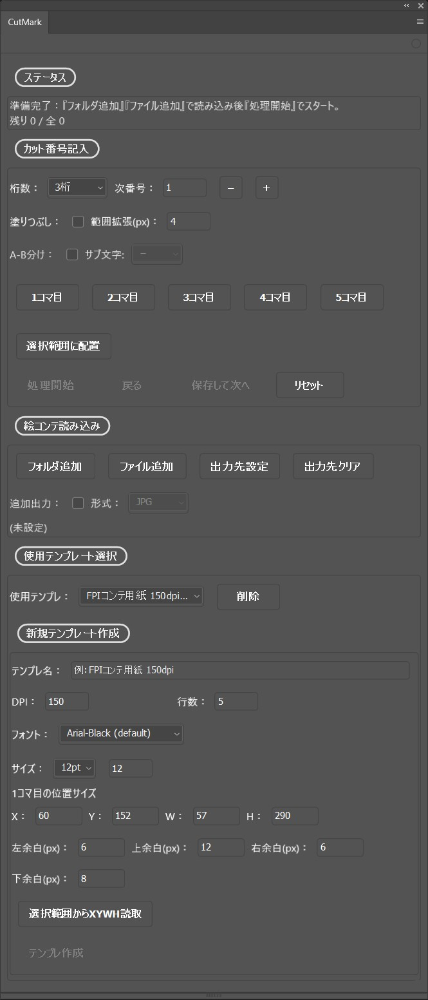

# CutMark (Photoshop UXP プラグイン)

Photoshop 用 UXP プラグイン **CutMark** の公開用リポジトリです。日本の縦書き絵コンテ用紙のカットナンバーの記入を効率化します。連番リネーム済みの画像を読み込みナンバリング後、PSD/JPG/PNG 書き出しを安全に行います。

## 主な機能
- 用紙テンプレートに基づくカット番号記入
- 任意の位置へのカット番号の配置
- キューにフォルダを読み込んで、連続処理

## 動作環境
- Adobe Photoshop 2023（ver24.4.0以降） / 動作チェックはPhotoshop 2026（ver27.0.0）で行っています
- Node.js 18 以上（コードを編集する場合）
- UXP Developer Tools（コードを編集する場合）

## セットアップ
- プラグインとして使用する場合
  1. 本リポジトリの Releases ページから CCX をダウンロードしてインストール
- コードを編集する場合
  1. 依存インストール: `npm install`
  2. ビルド: `npm run build`（`vendor/swc-bundle.js` と sourcemap を生成し、必要に応じて `dist/` と CCX を更新）

## 使い方ガイド
- 詳細手順は [CutMarkManual.md](./CutMarkManual.md) を参照してください。

## Photoshop での読み込み
- プラグインとして使用する場合
  1. Photoshop の Plugins から CutMark パネルを開く
- コードを編集する場合
  1. UXP Developer Tools で本フォルダを Add Plugin から読み込み
 

## ファイル構成
- `main.js` … パネルの起動エントリ
- `ui.js` … Spectrum UI 制御とユーザー操作ハンドリング
- `ps.js` … Photoshop DOM/API 呼び出し
- `state.js` … セッション状態管理
- `template.js` / `templates.json` … 用紙プリセット定義
- `index.html`, `styles.css` … UI 骨格とスタイル
- `vendor/` … `swc-entry.js` から生成された Spectrum Web Components バンドル（手編集禁止）

## 注意事項
- `vendor/` はビルド生成物のため直接編集しません。変更は `swc-entry.js` 側を更新し `npm run build` を実行してください。
- 公式版をそのまま使用する場合は `manifest.json` の `id` を変更しないでください。個人で改造し配布しない場合のみ独自のものに変更してください。

## ライセンス
MIT License。詳細は `LICENSE.md` を参照してください。

